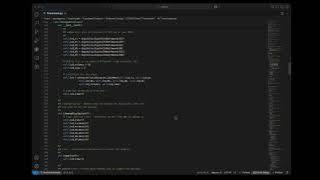

# CS-499 ePortfolio

August 17, 2025

## Introduction

My name is Stephen Green and this portfolio represents the culmination of my journey through the Computer Science program at SNHU. It highlights artifacts that demonstrate my skills in software design and engineering, algorithms and data structures, and databases. Each project reflects not only the technical knowledge I have gained but also the growth I have experienced in problem solving, critical thinking, and professional software practices. My goal is to showcase a body of work that demonstrates my readiness to contribute to the field of computer science with creativity, precision, and a commitment to continuous learning.

## Professional Self Assessment

Completing the Computer Science program and creating this ePortfolio has been a transformative experience that helped me strengthen my technical skills, clarify my professional goals, and prepare to enter the field as a confident and employable computer science professional. Each course challenged me to apply theory to practice, and the process of curating and improving artifacts for my ePortfolio has allowed me to identify and showcase my unique strengths. This self-assessment reflects on my learning journey, the skills I have gained, and how my portfolio demonstrates my readiness to contribute meaningfully to the field.

### Growth Through Coursework and Portfolio Development

Throughout the program, I built solid foundations in software design, algorithms, data management, and system security. Each project required technical implementation as well as problem-solving, creativity, and persistence. For instance, in my software engineering coursework, I developed a smart thermostat prototype and improved it by applying the Model-View-Controller design pattern and implementing unit testing. This demonstrated my ability to write modular, testable code while following industry-standard development practices. In my algorithms course, I built a sorting engine and expanded it to include advanced sorting methods, benchmarking, and input validation. In my database course, I designed a relational schema and refined it into a production-ready model aligned with best practices in normalization and data integrity. Collectively, these artifacts showcase my technical range and my capacity to evolve prototypes into professional-quality solutions.

### Key Professional Skills

This program also prepared me to succeed in professional settings beyond coding. I learned to collaborate in team environments, contributing to group projects where I coordinated code integration and reviewed peers’ work. I also gained experience in communicating with stakeholders by translating technical requirements into clear documentation and presentations, ensuring that non-technical audiences could understand design trade-offs and system behavior.

From a technical standpoint, I developed a strong command of data structures and algorithms, learning how to balance efficiency with maintainability and applying complexity analysis to guide design decisions. I improved my skills in software engineering by utilizing design patterns, refactoring codebases, and integrating unit testing into development workflows. My database projects enhanced my understanding of schema design, normalization, and query optimization. Lastly, I deepened my security knowledge by identifying vulnerabilities during code reviews and incorporating exception handling and validation strategies to build resilient software.

### Artifacts as a Cohesive Portfolio

The artifacts in this ePortfolio work together as a complete reflection of my growth. Each project started as a basic submission during coursework and was later refined to meet professional software engineering standards. The thermostat showcases software design and system architecture, the sorting engine highlights my expertise in algorithms and performance benchmarking, and the relational schema demonstrates my ability to structure and manage data effectively. Taken together, these pieces show both breadth and depth, emphasizing not only technical implementation but also ongoing improvement, which I see as essential to my professional identity.

### Looking Ahead

The capstone process and this portfolio have sharpened my career vision. I aim to pursue roles that combine technical skills with leadership, where I can leverage my engineering background to deliver secure, scalable, and user-focused solutions. I remain committed to continuous learning, including pursuing industry certifications in areas such as cloud architecture or secure coding. More importantly, I have gained the confidence to position myself not just as a capable developer but as a professional who understands how technology integrates into larger systems and communities.

## Course Outcomes

Through the completion of my Computer Science program and the development of this ePortfolio, I have demonstrated the ability to design scalable software systems, implement and analyze advanced algorithms, and architect efficient databases that support integrity and performance. I have built collaborative solutions in team environments, communicated technical ideas to diverse audiences, and applied secure coding practices that anticipate and mitigate vulnerabilities. My projects showcase problem-solving that balances trade-offs in scalability, maintainability, and performance while leveraging modern tools and techniques to deliver industry-ready solutions. Collectively, the artifacts in this portfolio illustrate how I integrate software design, data structures and algorithms, databases, and security into cohesive systems that provide value, enhance reliability, and reflect professional standards in computer science.

| **At a Glance** | **In Depth** |
|-----------------|--------------|
| **Software Engineering** – Built maintainable, scalable systems using MVC, modular design, and unit testing. | Applied advanced software engineering principles by refactoring systems into Model-View-Controller architecture, improving modularity, and implementing unit testing with Python’s unittest framework. Enhanced maintainability and supported long-term scalability. |
| **Algorithms & Data Structures** – Implemented and benchmarked advanced sorting algorithms with performance analysis. | Developed and compared multiple sorting algorithms including Merge Sort, Quick Sort, and Heap Sort. Used `std::chrono::high_resolution_clock` for precise benchmarking and implemented a reusable benchmarking framework with formatted reports. |
| **Databases** – Designed normalized relational databases with integrity constraints and optimized queries. | Created an entity relationship diagram and schema for a relational database. Applied normalization to reduce redundancy, enforced referential integrity, and optimized queries for efficiency and reliability. |
| **Security Mindset** – Anticipated exploits and enforced input validation and defensive programming. | Integrated secure coding practices such as exception handling, input validation, and privilege management. Designed software with resilience against vulnerabilities to protect data integrity and ensure system privacy. |
| **Collaboration** – Built solutions in environments requiring teamwork and shared decision making. | Engaged in collaborative development practices by producing shared artifacts, reviewing peer contributions, and aligning technical design decisions to organizational goals while fostering inclusive team dynamics. |
| **Communication** – Produced professional-quality technical reports and documentation for diverse audiences. | Delivered oral, written, and visual communications tailored to both technical and non-technical stakeholders. Created comprehensive documentation including function headers, inline comments, and complexity analysis to ensure clarity and accessibility. |
| **Problem Solving with Trade-offs** – Balanced design decisions against performance, scalability, and maintainability. | Designed and evaluated computing solutions by applying algorithmic principles and CS standards. Weighed performance trade-offs in algorithm selection and system architecture to align solutions with real-world requirements. |
| **Tools & Techniques** – Applied innovative techniques and modern tools to deliver solutions that provide industry value. | Used languages such as Python and C++ and tools like `unittest`, `std::chrono`, and database design platforms to build robust and industry-ready solutions. Demonstrated adaptability by applying well-founded techniques across different computing contexts. |
| **Systems Thinking** – Integrated design, algorithms, and data into cohesive real-world solutions. | Combined design principles, algorithm optimization, and database architecture into complete systems. Demonstrated the ability to reason across multiple layers of abstraction to deliver solutions that meet organizational needs. |

## Informal Code Review

As part of my capstone work, I conducted a detailed code review of three core artifacts selected for enhancement in my ePortfolio. The code review was an opportunity to analyze strengths, identify weaknesses, and plan specific improvements across software design and engineering, algorithms and data structures, and databases. This process demonstrated my ability to evaluate technical artifacts critically while also applying professional standards of readability, security, and maintainability. It also allowed me to reflect on my growth in applying systematic review practices that align with industry expectations. You can view the full code review here: [Code Review Link](https://youtu.be/gmgCL0tbqUM).

## Artifact One: Software Design and Engineering

The Smart Thermostat project is a Python-based application that models the core functions of an embedded thermostat system. This artifact was initially developed during the CS 350 Emerging Systems Architectures and Technologies course. It simulates hardware interactions such as reading temperature data, toggling LEDs to indicate heating and cooling states, and accepting user inputs to change modes or adjust the temperature set point. For the CS 499 capstone, I selected this artifact because it provides a clear opportunity to showcase my growth in software engineering and design, especially in system architecture, fault tolerance, and maintainability.

I chose this artifact for my ePortfolio because it highlights essential software development skills directly applicable to real-world engineering roles. Improving this project allowed me to demonstrate my ability to refactor code into a structured Model-View-Controller architecture. This separation of concerns makes the system more maintainable and scalable, which is crucial in professional software development. Additionally, the new implementation includes unit testing with Python’s unittest framework. This practice not only ensures that key components, such as state transitions and set-point management, function correctly but also reflects my understanding of test-driven development principles.

I also added exception handling for sensor failures, demonstrating my ability to anticipate real-world hardware issues and develop systems that handle them gracefully. Input validation was incorporated to enforce safe operating boundaries, reducing the risk of invalid temperature settings or unsupported mode selections. Together, these enhancements demonstrate my skills in modular design, testing, and secure coding practices.

The improvements made to this artifact align with the course outcomes. I demonstrated my ability to design and evaluate computing solutions using algorithmic and architectural principles while balancing tradeoffs between complexity and usability. I also employed well-founded techniques to build a system that can be reliably tested and maintained. After reviewing the final project rubric and conducting a security analysis, I identified additional areas for growth, such as implementing role-based access control and adding persistent logging. These enhancements are not yet included but represent logical next steps for the system’s development. For now, the improvements fully meet my original goals and serve as a strong example of my professional skills.

Reflecting on the process of improving this project, I gained valuable insights into software architecture and system design. One key lesson was the importance of creating software that is modular and testable, especially when simulating real-world hardware interactions. Designing unit tests for a system with simulated sensors required careful abstraction of hardware components so they could be tested independently from the rest of the system. I also learned how to incorporate fault tolerance into my designs by simulating potential sensor failures and implementing safe fallback mechanisms. Another challenge was managing user input in a simulated environment while ensuring the system remained flexible and robust. This experience deepened my understanding of how professional software engineers must balance system complexity with usability and maintainability. Overall, the process strengthened both my technical skills and my confidence in developing scalable, secure, and testable software solutions.

View [Artifact One Original](https://github.com/stephengreen2/CS499-Computer-Science-Capstone/tree/main/artifacts/software-design/original).

View [Artifact One Enhancement](https://github.com/stephengreen2/CS499-Computer-Science-Capstone/tree/main/artifacts/software-design/enhanced).

## Artifact Two: Algorithms and Data Structures

The artifact I selected for the algorithms and data structures category is a C++ application that sorts auction bid records. Originally developed in CS 260, the project reads bid data from a CSV file and applies basic sorting logic to organize the results. While functional, the original implementation was limited in both algorithm variety and structural quality. Improving this artifact allowed me to deeply engage with core concepts in algorithms and data structures, applying best practices for modularity, complexity analysis, and user experience.

This artifact now represents a significantly more advanced and professional application, earning its place in my ePortfolio. The enhancements I implemented were comprehensive and showcase a broad range of skills. I began by integrating multiple advanced sorting algorithms, including Merge Sort, an optimized version of Quick Sort with improved pivot selection, and Heap Sort. These additions guarantee O(n log n) performance and ensure robust handling of edge cases, including empty datasets. This allowed me to demonstrate a deeper understanding of algorithm selection and performance trade-offs.
A key architectural improvement was the introduction of a modular code structure. I created a BidSorter class that contains all sorting methods as static functions, separating the sorting logic from the user interface and aligning with the SOLID principles. This change significantly enhanced the maintainability and scalability of the program, making it easier to add new features or algorithms in the future.

Benchmarking was another central focus. I implemented precise performance tracking using `std::chrono::high_resolution_clock` and wrote a reusable, template-based benchmarking function. The application now provides formatted benchmark reports comparing execution times across all supported algorithms. This addition offers real-time performance feedback to the user and aligns with real-world expectations for algorithm analysis and evaluation.
Documentation was also improved. I added clear function headers that detail purpose, parameters, and complexity analysis. Inline comments explain algorithm steps, and each algorithm includes a written analysis of its time and space complexity. This level of documentation makes the program more accessible to both peers and potential employers reviewing the code.
To improve robustness, I implemented comprehensive input validation. A dedicated `getValidatedInput()` function manages invalid user selections, and safeguards have been added for handling malformed CSV files and empty datasets. Exception handling ensures graceful failure in cases of invalid conversions from strings to numbers.

The user experience also received significant enhancements. The interface now features a clean, professional menu system and user guidance throughout. Users can add manual entries for testing, and the program responds to user actions with clear, informative messages. All these improvements contribute to a polished and accessible experience.

These enhancements helped me meet my planned course outcomes by demonstrating my ability to design and evaluate computing solutions using algorithmic principles. I also showcased my use of innovative tools and practices, including modular design, benchmarking strategies, and clean code architecture. No changes are needed to my outcome-coverage plans, as this enhancement reinforces my initial goals.

Reflecting on the process, I learned how to balance algorithm performance with usability and maintainability. The technical challenge of designing extensible and efficient sorting logic necessitated revisiting fundamental data structures and making informed architectural decisions. Implementing benchmarking and error handling in C++ provided more profound insight into system-level thinking and performance trade-offs. Ultimately, this artifact captures my growth in designing structured, scalable, and efficient algorithmic solutions, making it a cornerstone of my ePortfolio.

View [Artifact One Original](https://github.com/stephengreen2/CS499-Computer-Science-Capstone/tree/main/artifacts/algorithms/original).

View [Artifact One Enhancement](https://github.com/stephengreen2/CS499-Computer-Science-Capstone/tree/main/artifacts/algorithms/enhanced).

## Artifact Three: Databases

The artifact I chose to showcase my skills in databases is a Flask-based web application that manages Return Merchandise Authorizations (RMAs) within a simulated business environment. Originally developed during the DAD 220 course, this artifact started as a basic database design project involving entity relationships, schema creation, and sample queries. For the capstone enhancement, I transformed that static design into a fully functional web app that interacts dynamically with a relational MySQL database through Flask's front-end and back-end integration.

I selected this artifact for my ePortfolio because it effectively represents the database design, implementation, and integration skills I have developed throughout the Computer Science program. Unlike a simple CRUD example, this artifact showcases complex schema planning, the use of stored procedures to encapsulate business logic, CSV-based data ingestion, and secure database interaction via SQLAlchemy and Python. The upgraded version is not just fully functional but also structured for professional deployment. It includes an automated setup script, environment variable handling, modular design with route segmentation, and test coverage.

Enhancing this artifact helped me demonstrate my competency in database-driven software development, aligning with the specific outcome outlined in Module One. My goal was to show the ability to design and implement a relational database and integrate it effectively within a web application. The improvements I planned during the code review—such as adding stored procedures, creating submission and reporting routes, and automating seeding with pandas—were successfully implemented. Additionally, I included a `.env` configuration template, unittest-based route testing, and comprehensive documentation to ensure the project is professional, portable, and maintainable.

Throughout the enhancement process, I gained a deeper understanding of best practices in secure database access and automation. One key challenge was integrating stored procedures into the Flask app while maintaining separation of concerns and keeping the application architecture flexible. I also needed to restructure the original schema scripts to combine table creation and procedure definitions into a single deployment routine. Another challenge involved handling CSV ingestion and mapping foreign key dependencies while ensuring referential integrity. Solving these issues required careful planning, error handling, and iterative testing.

Overall, this project deepened my appreciation for database-driven systems and the complexities involved in building robust, production-ready applications. It reflects both my technical skills and my ability to improve a system iteratively based on feedback, structured review, and professional coding standards. This artifact demonstrates my capacity to design and integrate scalable databases, automate deployments, and develop secure, efficient applications—all essential skills for a career in software development or data engineering.

View [Artifact One Original](https://github.com/stephengreen2/CS499-Computer-Science-Capstone/tree/main/artifacts/databases/original).

View [Artifact One Enhancement](https://github.com/stephengreen2/CS499-Computer-Science-Capstone/tree/main/artifacts/databases/enhanced).
